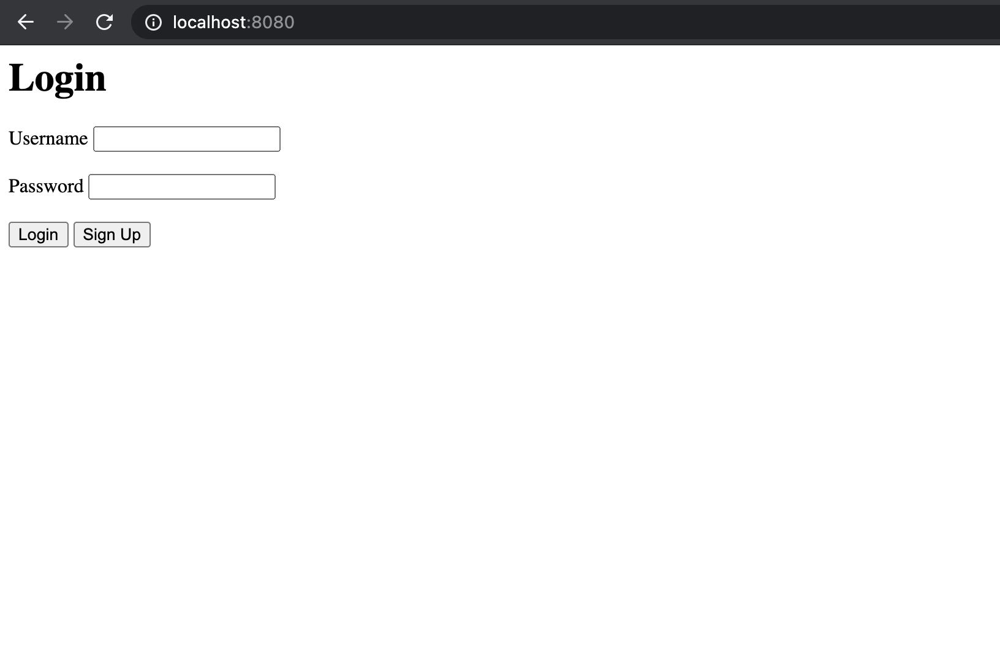

# entry-task

## Table of Content
1. [Run on macOS](#run-on-macos)
    1. [Prerequisites to run on macOS](#prerequisites-to-run-on-macos)
    1. [Launch server on macOS](#launch-server-on-macos)
    1. [Test on macOS](#test-on-macos)
1. [Run on Virtual Machine using Docker](#run-on-virtual-machine-using-docker)
    1. [Prerequisites to run on Docker](#prerequisites-to-run-on-docker)
    1. [Launch server on Docker](#launch-server-on-docker)
    1. [Test on Docker](#test-on-docker)

## Run on macOS

### Prerequisites to run on macOS

`Go` and `MySQL` are installed on the computer.

### Launch server on macOS

Before running, make sure the database configuration in the call of 
`sql.Open("mysql", "{user}:{password}@{host}/{database}")` in `cmd/usermanager/main.go#setDb()` matches the settings on 
the local device. In particular, make sure the database exists.

In the `entry-task` directory, run
```shell
go run cmd/usermanager/main.go
```
Do make sure the port :8080 is available. Then, open a 
browser, e.g. Chrome, and direct to `http://localhost:8080/`, one should see the following page.



The server can be stopped by simply press `Ctrl` + `C` in the terminal where the server is running. Log files are found 
in `build/logs` directory.

### Test on macOS

#### Unit Testing

Before running, make sure the database configuration in the call of `sql.Open(...)` (same as above) in 
`test/server_helpers/util.go#SetupDb(t *testing.T)` matches the settings on the local device. 

In the `entry-task` directory, to run validator tests, run 
```shell
go test test/validation_test.go
```
And to run handlers unit tests, run
```shell
go test test/handlers_test.go
```

### Massive Testing for Performance

#### Running test cases

First, make sure that the server has started.

To run 1000 login requests, run
```shell
go test test/loginHttpPerformance_test.go -parallel 100
```
To run 1000 different request types, run
```shell
go test test/mixedHttpPerformance_test.go -parallel 100
```

#### Running tests with profiling

If one wants to see the profile, one can run 
```shell
go test test/<test file name> <other flags> -cpuprofile <cpu profile file> -memprofile <mem profile file> -bench .
```
For example, 
```shell
go test test/loginHttpPerformance_test.go -parallel 100 \
-cpuprofile test/profiles/login_cpu.prof -memprofile test/profiles/login_mem.prof -bench .
``` 
Then, inspect the profile 
interactively using the `pprof` go tool by running 
```shell
go tool pprof <.prof file>
```
For example, 
```shell
go tool pprof test/profiles/login_cpu.prof
````

## Run on Virtual Machine using Docker

### Prerequisites to run on Docker

`Docker` is installed on the computer.

### Launch server on Docker

#### Setup database

First, start a MySQL server on Docker by running 
```shell
docker run --name=db -p 3306:3306 -e MYSQL_ROOT_HOST='%' -d mysql/mysql-server:latest --port=3306
```
Then, start the bash by running
```shell
docker exec -ti db bash
```
Run 
```shell
mysql -uroot -p
```
in the bash to start the MySQL command line tool. Use the password generated in logs to log in.

Then, change the password of localhost by running the following query in MySQL.
```sql
ALTER USER 'root'@'localhost' IDENTIFIED BY 'password';
``` 
Also, make sure that the user, password, and host in this database matches the `sql.Open` in `cmd/usermanager/main.go`, 
for example, run 
```sql
ALTER USER 'root'@'%' IDENTIFIED BY 'password';
```
In addition, create the database wanted if it does 
not exist, for example, run 
```sql
CREATE DATABASE IF NOT EXISTS entryTask;
```

#### Launch server

After the above steps are done, we can build the image to run the web app. Before this, make sure all the settings in 
the source code match the actual setting in the Docker environment, including the two calls of `sql.Open` in 
`cmd/usermanager/main.go` and `test/server_helpers/util.go`, and the paths.

In the `entry-task` directory, build the image called `server` by running 
```shell
docker build --tag server  -f deployments/app.dockerfile . --no-cache
```
Then, run the container also called `server` by running
```shell
docker run -p 8080:8080 --name server --link db:db -d server
```

Then, open the browser,and direct to `http://localhost:8080/`, one should see the index page. Do make sure the port 
:8080 is available. Stop other servers if they are using this port.

To stop the server, one can run 
```shell
docker stop server
```

### Test on Docker

Open bash on the server by running
```shell
docker exec -ti server bash
```
Then do the same thing as on macOS to do the tests.

## Further problems

1. I cannot connect to MySQL correctly using `docker-compose`.
1. Running on docker seem to be much slower than running using go test.