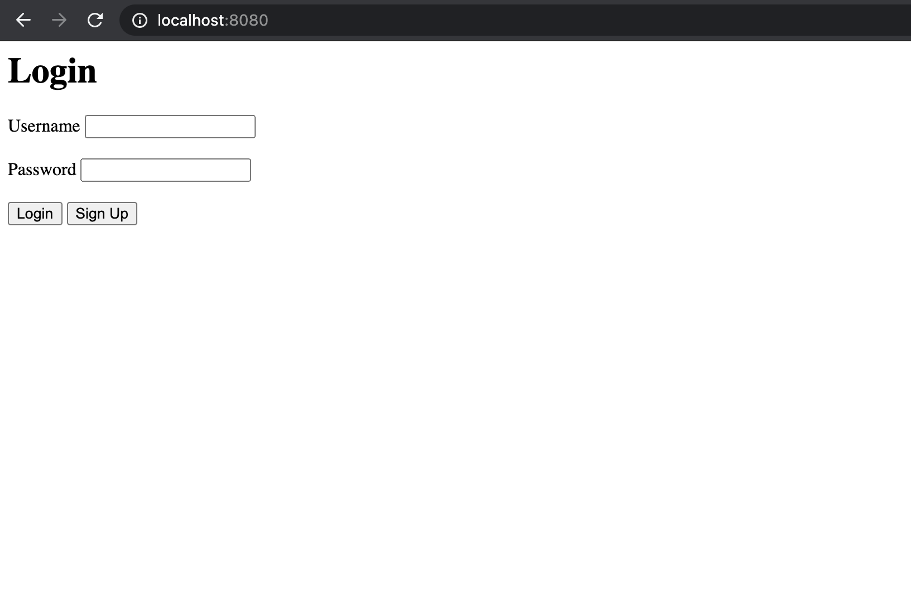
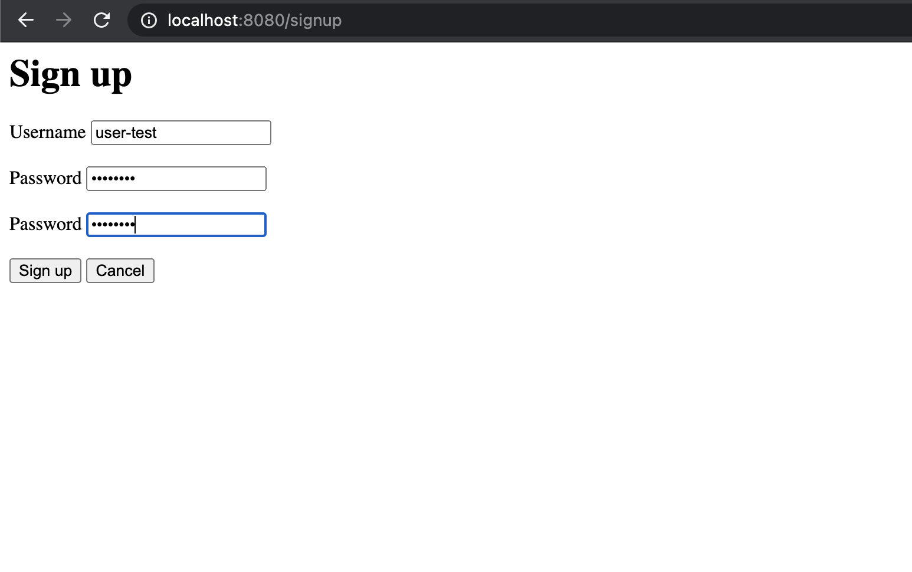
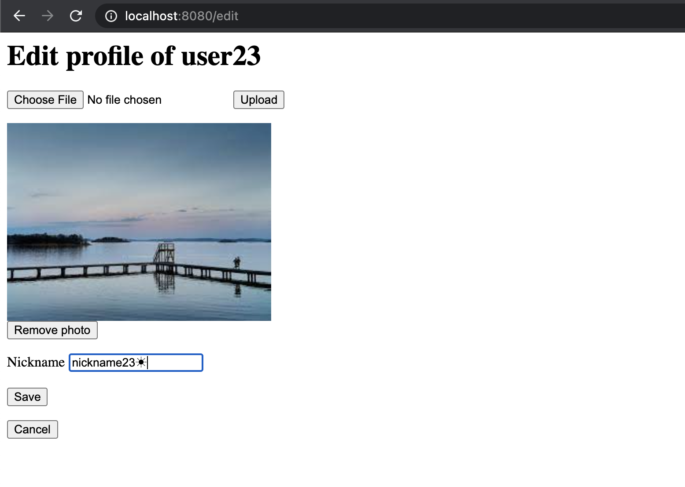

# Concluding Report

## Table of Content
1. [Objective](#objective)
    1. [Task context](#task-context)
    1. [Requirement](#requirement)
    1. [Performance requirement](#performance-requirement)
    1. [Environment](#environment)
    1. [Requirement specification website](#requirement-specification-website)
1. [Terminologies](#terminologies)
1. [Design](#design)
1. [Performance](#performance)
1. [Deployment](#deployment)
    1. [Running the app](#running-the-app)
    1. [Product](#product)
        1. [Introduction](#introduction)
        1. [Index Page](#index-page)
        1. [Signup Page](#signup-page)
        1. [View Page](#view-page)
        1. [Edit Page](#edit-page)
        1. [Reset Page](#reset-page)
1. [Limitations and Remarks](#limitations-and-remarks)
    1. [Assumptions](#assumptions)
    1. [Possible improvements](#possible-improvements)

----------------

## Objective

### Task context

* **Database:** the database is MySQL

* **Backend Server:** TCP server

* **Web Application Server:** connects to the Backend Server and provides web pages (UI)

* **Log:** There must be at least `debug`, `info`, `error` log levels in it. Log files must be able to rotate 
automatically.

### Requirement

To Implement a user manager system for user to login and edit their profiles, which consists of an HTTP backend server 
in which core logics will be located, a Web Application Server where users can login on web page.After a user inputs 
his/her username and password, the backend system will authenticate his/her identity. If login is successful, the 
relevant user information is displayed, otherwise an error message will be shown.After a successful login, a user can 
edit the following information:
1. Upload a picture as his/her profile picture
1. Change his/her nickname (support unicode characters with utf-8 encoding)

User information includes: username (cannot be changed), nickname, profile picture. For test, the initial user data can 
be directly inserted into database. Make sure there are at least 10 million user accounts in the test database. Every 
key point of logic in system must be recorded to log, e.g. everyone is able to know what was happening, when happened, 
to whom, according to the log records.

### Performance requirement

* Supports up to 1000 login requests per second (from at least 200 unique users)
* Supports up to 1000 concurrent http requests

### Environment
* **Server:** Virtual Machine on Working PC
* **OS:** CentOS 7 x64 or Ubuntu 14.04 above
* **DB:** MySQL 5.7 or above
* **Client:** Chrome

### Requirement specification website
https://confluence.shopee.io/pages/viewpage.action?spaceKey=SPDP&title=Deep+Platform+-+Server+Engineer+-+Entry+Task

## Terminologies

* **user info:** username and password
* **user profile:** profile photo and nickname

## Design

Refer to the [Design](Design.md) document.

## Performance

Refer to the [Performance](Performance.md) document.

## Deployment

### Running the app

Refer to [README](../README.md).

### Product

#### Introduction

The product of the project is a web app which runs on localhost:8080. It uses cookie to handle sessions, which is
encoded, so this product is aimed for actual users to implement in browsers like Chrome. Plain HTTP requests can only
be executed as expected with users logged in when they are executed in specific orders (for example, before try to
edit or reset, the user should log in first), and the client must track the cookies.

There are five main pages of the app, shown as follows.

#### Index Page

This is the homepage of the app, with a username text field and password text field.

When the login button is clicked, the behavior is:
* If the username exists:
    * If the password is correct: redirect to view page with this user's information.
    * If the password is incorrect: stays on the same page with an error message telling that the password is incorrect
      besides the password text input field.
* If the username does not exist:
    * Redirect to the signup page with this username.

When the signup button is clicked, it directly redirects to the signup page.

#### Signup Page

The signup page has an additional password box for the user to confirm the password compared to login page.

When the signup button is clicked, the behavior is:
* If the username is valid, i.e. has 4-20 (inclusive) characters with only alphanumerical characters and/or hyphen ('-')
  and underscore ('_'), starting with an alphabetical character:
    * If the username already exists in the database: one will stay on the page, and an error message will appear besides
      the username input box.
    * If the username is not registered yet:
        * If the password is 4-20 (inclusive) characters:
            * If the second password is the same as the first one: the user is added to the database, i.e. successfully
              signed up, and redirected to the edit information for the user to provide profile.
            * If the second password is not the same as the first one: one will stay on the page, and an error message will
              appear besides the second password input box.
        * If the password is not 4-20 (inclusive) characters: one will stay on the page, and an error message will show
          besides the first password input box.
* If the username is invalid: one will stay on the page, and an error message will appear besides the username input box.

When the cancel button is clicked, it directly redirects to the index page.

#### View Page

After successful login (or profile updating after sign up), one can see the view page with this user's information,
including username, nickname, and photo.

The nickname is the string after "Hi," at the title. The username is indicated in the "User:" field. The photo is
displayed under the "Photo:" field. The photo is originally encrypted and stored in a file base. When a user logs in,
the photo is decrypted and copied locally to be accessed and displayed.

If the user does not have a nickname, the string after "Hi," is "user " followed by the username. If the user does not
have a photo, a placeholder photo is used, which is shown in the screenshot.

When edit or reset button is clicked, it redirects to edit and reset page respectively. When logout button is clicked,
the user logs out, and the local temporary decrypted photo is removed. When delete button is clicked, the user is
deleted permanently from the database, and both its local temporary decrypted file and its encrypted photo in the file
base are removed.

#### Edit Page

After successful login (or sign up), a user can choose to edit profile, including profile photo and nickname.

One can click on the button to choose file, which opens a file browser and allows the user to upload a file. Then, upon
clicking the upload button besides, the local temporary photo is updated as a copy of the new photo, and the photo shown
below is updated. Of course, one can also choose to remove this photo. One can also update the nickname. It supports
UTF-8 encoding.

When save button is clicked, all information in this page is stored and used to replace the original data of the user in
the database. If the photo is removed before saving, the profile photo in the file base is also removed when changes are
saved.

When cancel button is clicked, all changes made are aborted. The user profile photo is regenerated from data in the
database and file in the file base.

Both bottons redirect to the view page after clicking.

#### Reset Page

After successful login (or sign up), a user can choose to reset basic information, including username and password. The
reset page shares the same template with signup, and their behaviors are similar.

A note to mention is that when password is updated, the photo in the file base is updated accordingly so that it is
encrypted using the new password.

## Limitations and Remarks

### Assumptions

1. Users log out each time. If they leave the pages (especially the edit page) right away, no significant bug would 
   appear, but some files that may be expected to be cleaned may resist there, and there would be no logging information
   about the user leaving the page.
1. Requests are made in sequence with cookie. For example, to execute a valid `POST /edit` request, the `POST /login` 
   request must be handled first with the cookie sent to the subsequent `POST /edit` request. This is because
   1. The cookie used to handle session is encoded in a specific manner, so that it is hard for clients to set the 
      headers manually.
   1. After logging in, credentials are not checked again.

### Possible improvements

1. The docker containers of GoLang web app and MySQL server are run separately but connected, so the runtime for the 
   requests with SQL queries to the database is much slower. Running `go test` in `bash` of the `server` container 
   cannot meet the requirement for 1000 requests in a second.
1. All data are accessed and stored in the local device currently. This can be simply improved by using a remote 
   database in `sql.Open` calls, and change the settings in the `paths` package.