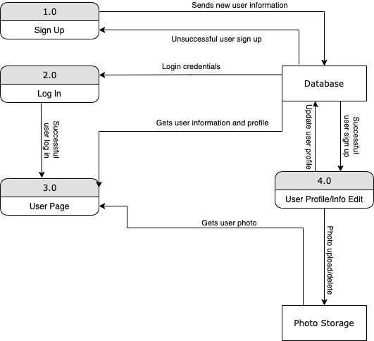

# Design

## Architecture/Structure

The app is a simple web application with the web app server connected to a database (see Figure below). HTTP requests are sent by the clients to the server and handled as queries to database. The web app server gets data from the database and send the information as HTTP response back to the client.


## Strategies & Algorithms

1. A server socket port is started waiting for incoming connection requests.
1. A client socket is created to connect to the server socket as connection socket.
1. An HTTP request is sent from the client socket and read by the connection socket. Possible requests are seen in [API Design](#api-design) section. Socket programming as well as HTTP requests handling are written in GoLang.
1. Database queries are made based on the requests and data is fetched from the database (to be elaborated separately below). The database used is MySQL and github.com/go-sql-driver/mysql is used to integrate with GoLang.
1. The connection socket generates corresponding HTTP responses based on the results from database and send to the client socket.
1. The client socket read the response from connection socket and report to the user.
1. Repeat 3 to 6 to handle more requests from the user.
1. Close the current client socket.
1. Repeat 2 to 8 to handle requests from more users, possibly simultaneously.
1. Close the connection socket.

## API Design

| Method | Path             | Description                               |
|--------|------------------|-------------------------------------------|
| GET    | /                | Home page                                 |
| GET    | /signup          | Sign up page                              |
| POST   | /signup          | Add a new user to the database            |
| GET    | /login           | Log in page                               |
| GET    | /:username       | Profile display page of the user          |
| DELETE | /:username       | Delete the user from database             |
| GET    | /:username/edit  | Edit profile page                         |
| POST   | /:username/edit  | Upgrade user profile in the database      |
| GET    | /:username/reset | Reset user info page                      |
| POST   | /:username/reset | Upgrade user info in the database         |
* Note: user info refers to username and password, and user profile refers to the user profile photo and nickname.

### GET `/`
Display the homepage to the user from the HTML template that allows the user to choose to sign up or log in.

### GET `/signup`
Display the sign up page to the user from the HTML template that allows the user to provide the username and password that the user wants to sign up for.

### POST `/signup`
Insert a new user to the database with the username and password specified. Then redirect to `GET /:username/edit` to ask the user to provide initial profile.

### GET `/login`
Display the log in page to the user from the HTML template that allows the user to provide the username and password. Successful login would result to `GET /:username`

### GET `/:username`
Display the profile page to the user from the HTML template that allows the user to view the username, nickname, and profile photo, and choose to edit profile, reset password, or delete user.

### DELETE `/:username`
Delete the user from the database and redirect to the homepage.

### GET `/:username/edit`
Display the edit profile page to the user from the HTML template that allows the user to (re-)upload profile photo and/or change a nickname.

### POST `/:username/edit`
Save the photo uploaded by the user and get its address. Then save the changes to the user profile to the database and redirect to `GET /:username`.

### GET `/:username/reset`
Display the reset user info page to the user from the HTML template that allows the user to reset the password.

### POST `/:username/reset`
Save the new user info and update the database accordingly. Then redirect to `GET /:username`.

PS. I'm also considering using sessions instead of using username explicitly in the path, which may be more secure, but I'm not sure about its implementation now.

## Data Schema Design

Only on table is needed, so ER diagram is not needed. The table creation query in SQL is as follows.

```
CREATE TABLE users (
    username    VARCHAR(20) PRIMARY KEY,
    password    VARCHAR(20) NOT NULL,
    photo       VARCHAR(50),
    nickanme    VARCHAR(30) COLLATE Latin1_General_100_CI_AI_SC_UTF8
);
```

### Username
The username is the primary key that uniquely identifies each user. The username should be a 4-20 character string containing numbers, letters, and hyphens ("-") only, and duplicate username is not allowed.

### Password
The password should not be null, and the password that user provides should be a 4-20 character string. The original password is hashed before it is saved to the database.

### Photo
The photos are stored as files at some particular place with a path known, and this path is the content of the photo attribute in the database. This method of photo handling is preferred over storing the photo directly as `VARBINARY` in the database because of the following reasons:
1. Photos are usually big files, which may use too much space in the database.
1. If the photo is directly stored in the database, anyone with access to the database can access the photo, whereas storing the photo files separately makes seperate authentification and access to the photos possible, so it potentially protects the user's information in a sense.

### Nickname
The nickname can be any UTF-8 string of no more than 30 characters.

## Data Flow

The dataflow is seen as follows.



## Backward Compatibility

## Dependencies

## Resource Estimation

