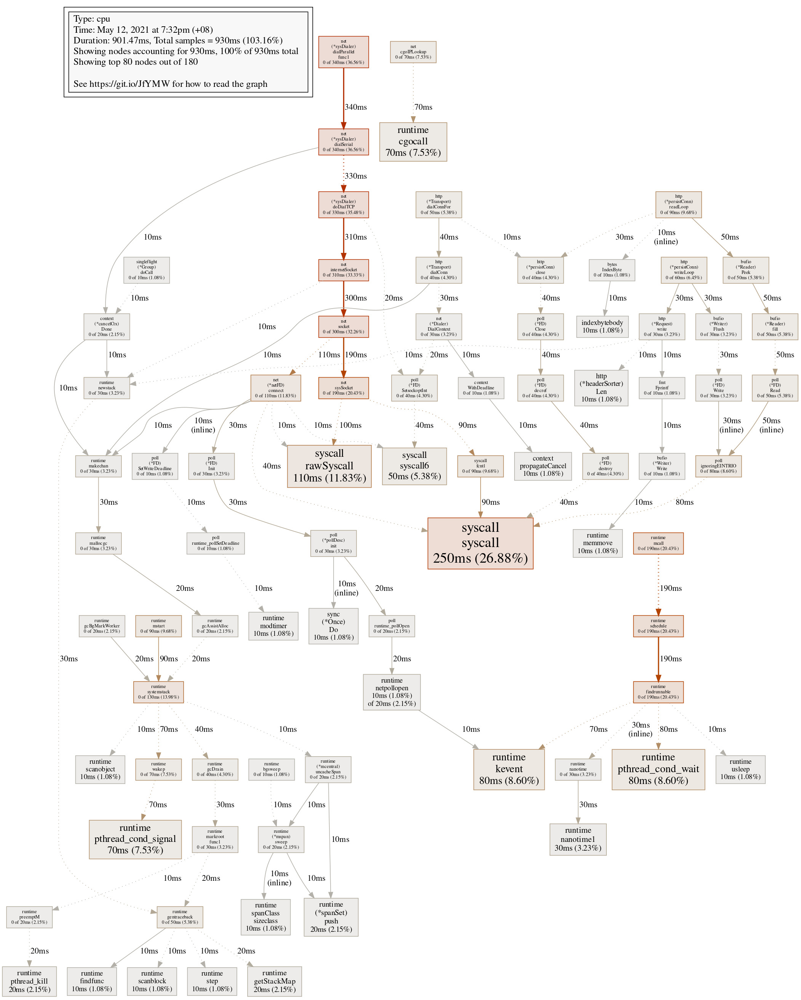

# Performance

## Table of Content
1. [Product and Implementation](#product-and-implementation)
    1. [Introduction](#introduction)
    1. [Index Page](#index-page)
    1. [Signup Page](#signup-page)
    1. [View Page](#view-page)
    1. [Reset Page](#reset-page)
1. [Request Handling Speed](#request-handling-speed)
    1. [Environment](#environment)
    1. [Login Requests](#login-requests)
    1. [Mixed Type of Requests](#mixed-type-of-requests)

---------

## Product and Implementation

### Introduction

The product of the project is a web app which runs on localhost:8080. It uses cookie to handle sessions, which is 
encoded, so this product is aimed for actual users to implement in browsers like Chrome. Plain HTTP requests can only 
be executed as expected with users logged in when they are executed in specific orders (for example, before try to 
edit or reset, the user should log in first), and the client must track the cookies.

There are five main pages of the app, shown as follows.

### Index Page

This is the homepage of the app, with a username text field and password text field. 

When the login button is clicked, the behavior is:
* If the username exists:
    * If the password is correct: redirect to view page with this user's information.
    * If the password is incorrect: stays on the same page with an error message telling that the password is incorrect
      besides the password text input field.
* If the username does not exist:
    * Redirect to the signup page with this username.

When the signup button is clicked, it directly redirects to the signup page.

### Signup Page

The signup page has an additional password box for the user to confirm the password compared to login page.

When the signup button is clicked, the behavior is:
* If the username is valid, i.e. has 4-20 (inclusive) characters with only alphanumerical characters and/or hyphen ('-')
  and underscore ('_'), starting with an alphabetical character:
  * If the username already exists in the database: one will stay on the page, and an error message will appear besides
    the username input box.
  * If the username is not registered yet:
    * If the password is 4-20 (inclusive) characters:
      * If the second password is the same as the first one: the user is added to the database, i.e. successfully 
      signed up, and redirected to the edit information for the user to provide profile.
      * If the second password is not the same as the first one: one will stay on the page, and an error message will 
      appear besides the second password input box.
    * If the password is not 4-20 (inclusive) characters: one will stay on the page, and an error message will show 
    besides the first password input box.
* If the username is invalid: one will stay on the page, and an error message will appear besides the username input box.

When the cancel button is clicked, it directly redirects to the index page.

### View Page

After successful login (or profile updating after sign up), one can see the view page with this user's information, 
including username, nickname, and photo.

The nickname is the string after "Hi," at the title. The username is indicated in the "User:" field. The photo is 
displayed under the "Photo:" field. The photo is originally encrypted and stored in a file base. When a user logs in,
the photo is decrypted and copied locally to be accessed and displayed.

If the user does not have a nickname, the string after "Hi," is "user " followed by the username. If the user does not 
have a photo, a placeholder photo is used, which is shown in the screenshot.

When edit or reset button is clicked, it redirects to edit and reset page respectively. When logout button is clicked, 
the user logs out, and the local temporary decrypted photo is removed. When delete button is clicked, the user is 
deleted permanently from the database, and both its local temporary decrypted file and its encrypted photo in the file 
base are removed.

### Edit Page

After successful login (or sign up), a user can choose to edit profile, including profile photo and nickname.

One can click on the button to choose file, which opens a file browser and allows the user to upload a file. Then, upon 
clicking the upload button besides, the local temporary photo is updated as a copy of the new photo, and the photo shown 
below is updated. Of course, one can also choose to remove this photo. One can also update the nickname. It supports 
UTF-8 encoding.

When save button is clicked, all information in this page is stored and used to replace the original data of the user in 
the database. If the photo is removed before saving, the profile photo in the file base is also removed when changes are 
saved.

When cancel button is clicked, all changes made are aborted. The user profile photo is regenerated from data in the 
database and file in the file base.

Both bottons redirect to the view page after clicking.

### Reset Page

After successful login (or sign up), a user can choose to reset basic information, including username and password. The
reset page shares the same template with signup, and their behaviors are similar.

A note to mention is that when password is updated, the photo in the file base is updated accordingly so that it is 
encrypted using the new password.

## Request Handling Speed

### Environment

The test cases are run with a server running by `go run` command from command line. Before the test cases, the database
already contains 200 unique users. No goroutine is used in original code and test code.

The test cases are run on macOS.

### Login Requests

#### Test case design

The test cases for login requests are 1000 requests of 200 unique users, 5 for each user, with correct password.

Only successful login requests are used for the test because this is the case with the longest expected time. The most 
time-consuming procedures for login requests are retrieving user information from the database and hashing password, 
compared to which other parts of the program takes negligible time. Successful login requests need to go through both 
the time-consuming steps, so they are chosen for testing. In particular, retrieving information from the database is 
executed by every login requests, which takes noticeably less time than password hashing, which happens only for cases 
that the username is found in the database.

#### Performance

When running the tests without parallel testing (i.e. running with flag `-parallel 1`), the time taken for 1000 requests
are mostly in the range of 3.35-3.70 s, with the average time 3.571 s. Hence, it may be inferred that each 
request is handled using about 3.5±2 ms.

The general range for running the tests with `-parallel 10` is about 1.02±0.07 s, and running with `-parallel 100` is 
0.93±0.08 s. When the number of parallel tests running simultaneously is greater than 10, the change in performance is 
insignificant. This would mean that including the time for test cases setup, the time required to run the 1000 requests
approaches to some time duration slightly below 1 s (around 0.93 s), which meets the requirement for 1000 login requests
per second.

However, when the number of parallel test cases is too large (larger than about 200), some test cases would fail due to 
failure in connection to the database. The database may not be able to run stably when there are too many connections. 
Nevertheless, the performance is already satisfiable.

### Mixed Type of Requests

#### Test case design

As mentioned in [Introduction of Product and Implementation](#introduction), it is hard to implement all kinds of 
requests simultaneously. Some tests need to be run after certain tests (in particular, requests of user-specific actions 
need to be made after login/signup request.) Hence, the 1000 mixed-type requests chosen can never be executed 
simultaneously.

There are 2 main groups of test cases chosen, each group can be run independently (and hence concurrently). However, 
requests in the same group are run in order.

1. Group 1
    1. Login to existing user (`POST /login`), invokes a `SELECT` query.
    1. View this user after successful login (`GET /view`), invokes no query (use cookie results from login).
    1. Edit this user after successful login (`POST /edit`), invokes an `UPDATE` query.
1. Group 2
    1. Signup test user (`POST /signup`), invokes a `SELECT` (check duplicates) and an `INSERT` query.
    1. Delete test user after successful signup (`POST /delete`) invokes a `DELETE` query.

All requests are scenarios of success (for example, successful login, successful signup, etc.), as successful scenarios 
do not skip any time-consuming steps for each request.

#### Performance

Since requests are grouped, running with `-parallel 1` does not seem to provide other useful information, so the results
are not shown here. The time for `-parallel 10` is about 1.37±0.12 s, and time for `-parallel 100` is about 0.79±0.08 s.
Hence, it also fulfills the requirement for 1000 requests within a second when about 100 test cases (requests) are 
allowed to run in parallel.

#### Profile

A sample run of the test cases gives the following profile data.

The top 10 samples (out of 180) in the profile are

      flat  flat%   sum%        cum   cum%
     250ms 26.88% 26.88%      250ms 26.88%  syscall.syscall
     110ms 11.83% 38.71%      110ms 11.83%  syscall.rawSyscall
      80ms  8.60% 47.31%       80ms  8.60%  runtime.kevent
      80ms  8.60% 55.91%       80ms  8.60%  runtime.pthread_cond_wait
      70ms  7.53% 63.44%       70ms  7.53%  runtime.cgocall
      70ms  7.53% 70.97%       70ms  7.53%  runtime.pthread_cond_signal
      50ms  5.38% 76.34%       50ms  5.38%  syscall.syscall6
      30ms  3.23% 79.57%       30ms  3.23%  runtime.nanotime1
      20ms  2.15% 81.72%       20ms  2.15%  runtime.(*spanSet).push
      20ms  2.15% 83.87%       20ms  2.15%  runtime.getStackMap
