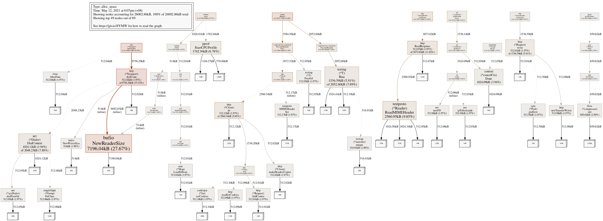
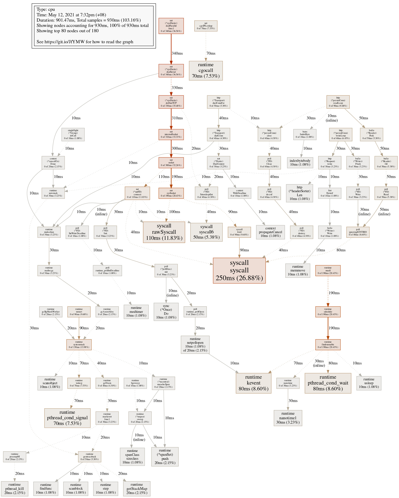
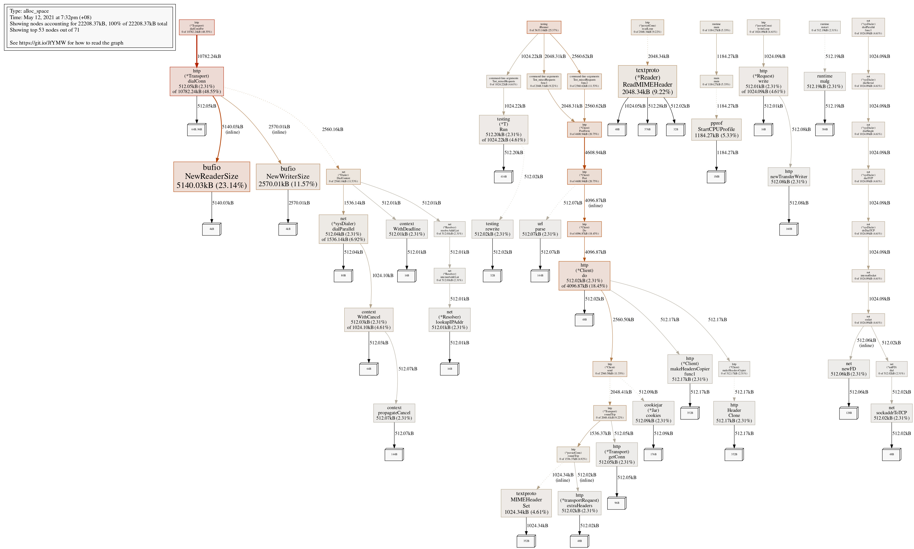

# Performance

## Table of Content
1. [Environment](#environment)
1. [Login Requests](#login-requests)
1. [Mixed Type of Requests](#mixed-type-of-requests)

---------

## Environment

The test cases are run with a server running by `go run` command from command line. Before the test cases, the database
already contains 200 unique users. No goroutine is used in original code and test code.

The test cases are run on macOS.

## Login Requests

### Test case design

The test cases for login requests are 1000 requests of 200 unique users, 5 for each user, with correct password.

Only successful login requests are used for the test because this is the case with the longest expected time. The most 
time-consuming procedures for login requests are retrieving user information from the database and hashing password, 
compared to which other parts of the program takes negligible time. Successful login requests need to go through both 
the time-consuming steps, so they are chosen for testing. In particular, retrieving information from the database is 
executed by every login requests, which takes noticeably less time than password hashing, which happens only for cases 
that the username is found in the database.

### Performance

When running the tests without parallel testing (i.e. running with flag `-parallel 1`), the time taken for 1000 requests
are mostly in the range of 3.35-3.70 s, with the average time 3.571 s. Hence, it may be inferred that each 
request is handled using about 3.5±2 ms.

The general range for running the tests with `-parallel 10` is about 1.02±0.07 s, and running with `-parallel 100` is 
0.93±0.08 s. When the number of parallel tests running simultaneously is greater than 10, the change in performance is 
insignificant. This would mean that including the time for test cases setup, the time required to run the 1000 requests
approaches to some time duration slightly below 1 s (around 0.93 s), which meets the requirement for 1000 login requests
per second.

However, when the number of parallel test cases is too large (larger than about 200), some test cases would fail due to 
failure in connection to the database. The database may not be able to run stably when there are too many connections. 
Nevertheless, the performance is already satisfiable.

### Profile

#### CPU profile

A sample run of the test cases gives the following profile data.

The top 10 samples (out of 188) in the profile are shown as follows.

      flat  flat%   sum%        cum   cum%
     260ms 26.00% 26.00%      270ms 27.00%  syscall.syscall
     110ms 11.00% 37.00%      110ms 11.00%  runtime.pthread_cond_signal
     110ms 11.00% 48.00%      110ms 11.00%  syscall.rawSyscall
     100ms 10.00% 58.00%      100ms 10.00%  runtime.kevent
      60ms  6.00% 64.00%       60ms  6.00%  runtime.nanotime1
      50ms  5.00% 69.00%       50ms  5.00%  runtime.cgocall
      40ms  4.00% 73.00%       40ms  4.00%  runtime.pthread_cond_wait
      30ms  3.00% 76.00%      250ms 25.00%  net.sysSocket
      20ms  2.00% 78.00%       20ms  2.00%  runtime.memclrNoHeapPointers
      20ms  2.00% 80.00%       40ms  4.00%  runtime.netpollopen

The top 10 samples of cumulative space are shown as follows.

      flat  flat%   sum%        cum   cum%
         0     0%     0%      370ms 37.00%  net.(*sysDialer).dialParallel.func1
         0     0%     0%      370ms 37.00%  net.(*sysDialer).dialSerial
         0     0%     0%      360ms 36.00%  net.(*sysDialer).dialSingle
         0     0%     0%      350ms 35.00%  net.(*sysDialer).dialTCP
         0     0%     0%      350ms 35.00%  net.(*sysDialer).doDialTCP
         0     0%     0%      350ms 35.00%  net.internetSocket
         0     0%     0%      350ms 35.00%  net.socket
     260ms 26.00% 26.00%      270ms 27.00%  syscall.syscall
      30ms  3.00% 29.00%      250ms 25.00%  net.sysSocket
         0     0% 29.00%      210ms 21.00%  runtime.findrunnable

Handling requests consumes the most flat time, and dialing connections are the most time-consuming procedures 
cumulatively.

#### Mem profile

A sample run of the test cases gives the following profile data.

The top 10 samples (out of 89) in the profile are shown as follows.

          flat  flat%   sum%        cum   cum%
     7196.04kB 27.67% 27.67%  7196.04kB 27.67%  bufio.NewReaderSize
     2560.95kB  9.85% 37.52%  2560.95kB  9.85%  net/textproto.(*Reader).ReadMIMEHeader
     1762.94kB  6.78% 44.30%  1762.94kB  6.78%  runtime/pprof.StartCPUProfile
     1536.59kB  5.91% 50.21%  2052.60kB  7.89%  testing.(*T).Run
     1024.12kB  3.94% 54.15%  2048.23kB  7.88%  net.(*Dialer).DialContext
     1024.09kB  3.94% 58.09%  1024.09kB  3.94%  context.(*cancelCtx).Done
      650.62kB  2.50% 60.59%   650.62kB  2.50%  compress/flate.(*compressor).init
      516.01kB  1.98% 62.58%   516.01kB  1.98%  testing.(*matcher).unique
         514kB  1.98% 64.55%      514kB  1.98%  bufio.NewWriterSize
      512.50kB  1.97% 66.52%   512.50kB  1.97%  sync.(*Pool).pinSlow

The top 10 samples of cumulative space are shown as follows.

          flat  flat%   sum%        cum   cum%
             0     0%     0% 10268.33kB 39.49%  net/http.(*Transport).dialConnFor
      512.02kB  1.97%  1.97%  9756.29kB 37.52%  net/http.(*Transport).dialConn
     7196.04kB 27.67% 29.64%  7196.04kB 27.67%  bufio.NewReaderSize (inline)
             0     0% 29.64%  5637.17kB 21.68%  testing.tRunner
             0     0% 29.64%  3584.56kB 13.79%  command-line-arguments.Test_loginRequests.func1
             0     0% 29.64%  3073.02kB 11.82%  net/http.(*persistConn).readLoop
             0     0% 29.64%  3073.02kB 11.82%  net/http.(*persistConn).readResponse
      512.07kB  1.97% 31.61%  3073.02kB 11.82%  net/http.ReadResponse
             0     0% 31.61%  3072.52kB 11.82%  net/http.(*Client).Post
             0     0% 31.61%  3072.52kB 11.82%  net/http.(*Client).PostForm

Handling requests and dialing connections are the most space-consuming procedures.

## Mixed Type of Requests

### Test case design

As mentioned in [Introduction of Product and Implementation](#introduction), it is hard to implement all kinds of 
requests simultaneously. Some tests need to be run after certain tests (in particular, requests of user-specific actions 
need to be made after login/signup request.) Hence, the 1000 mixed-type requests chosen can never be executed 
simultaneously.

There are 2 main groups of test cases chosen, each group can be run independently (and hence concurrently). However, 
requests in the same group are run in order.

1. Group 1
    1. Login to existing user (`POST /login`), invokes a `SELECT` query.
    1. View this user after successful login (`GET /view`), invokes no query (use cookie results from login).
    1. Edit this user after successful login (`POST /edit`), invokes an `UPDATE` query.
1. Group 2
    1. Signup test user (`POST /signup`), invokes a `SELECT` (check duplicates) and an `INSERT` query.
    1. Delete test user after successful signup (`POST /delete`) invokes a `DELETE` query.

All requests are scenarios of success (for example, successful login, successful signup, etc.), as successful scenarios 
do not skip any time-consuming steps for each request.

### Performance

Since requests are grouped, running with `-parallel 1` does not seem to provide other useful information, so the results
are not shown here. The time for `-parallel 10` is about 1.37±0.12 s, and time for `-parallel 100` is about 0.79±0.08 s.
Hence, it also fulfills the requirement for 1000 requests within a second when about 100 test cases (requests) are 
allowed to run in parallel.

### Profile

#### CPU profile

A sample run of the test cases gives the following profile data.

The top 10 samples (out of 180) in the profile are shown as follows.

      flat  flat%   sum%        cum   cum%
     250ms 26.88% 26.88%      250ms 26.88%  syscall.syscall
     110ms 11.83% 38.71%      110ms 11.83%  syscall.rawSyscall
      80ms  8.60% 47.31%       80ms  8.60%  runtime.kevent
      80ms  8.60% 55.91%       80ms  8.60%  runtime.pthread_cond_wait
      70ms  7.53% 63.44%       70ms  7.53%  runtime.cgocall
      70ms  7.53% 70.97%       70ms  7.53%  runtime.pthread_cond_signal
      50ms  5.38% 76.34%       50ms  5.38%  syscall.syscall6
      30ms  3.23% 79.57%       30ms  3.23%  runtime.nanotime1
      20ms  2.15% 81.72%       20ms  2.15%  runtime.(*spanSet).push
      20ms  2.15% 83.87%       20ms  2.15%  runtime.getStackMap

The top 10 samples of cumulative time are shown as follows.

      flat  flat%   sum%        cum   cum%
         0     0%     0%      340ms 36.56%  net.(*sysDialer).dialParallel.func1
         0     0%     0%      340ms 36.56%  net.(*sysDialer).dialSerial
         0     0%     0%      330ms 35.48%  net.(*sysDialer).dialSingle
         0     0%     0%      330ms 35.48%  net.(*sysDialer).dialTCP
         0     0%     0%      330ms 35.48%  net.(*sysDialer).doDialTCP
         0     0%     0%      310ms 33.33%  net.internetSocket
         0     0%     0%      300ms 32.26%  net.socket
     250ms 26.88% 26.88%      250ms 26.88%  syscall.syscall
         0     0% 26.88%      190ms 20.43%  net.sysSocket
         0     0% 26.88%      190ms 20.43%  runtime.findrunnable

Handling requests consumes the most flat time, and dialing connections are the most time-consuming procedures 
cumulatively.

#### Mem profile

A sample run of the test cases gives the following profile data.

The top 10 samples (out of 71) in the profile are shown as follows. 

          flat  flat%   sum%        cum   cum%
     5140.03kB 23.14% 23.14%  5140.03kB 23.14%  bufio.NewReaderSize
     2570.01kB 11.57% 34.72%  2570.01kB 11.57%  bufio.NewWriterSize
     2048.34kB  9.22% 43.94%  2048.34kB  9.22%  net/textproto.(*Reader).ReadMIMEHeader
     1184.27kB  5.33% 49.27%  1184.27kB  5.33%  runtime/pprof.StartCPUProfile
     1024.34kB  4.61% 53.89%  1024.34kB  4.61%  net/textproto.MIMEHeader.Set
      512.20kB  2.31% 56.19%  1024.22kB  4.61%  testing.(*T).Run
      512.19kB  2.31% 58.50%   512.19kB  2.31%  runtime.malg
      512.17kB  2.31% 60.80%   512.17kB  2.31%  net/http.(*Client).makeHeadersCopier.func1
      512.17kB  2.31% 63.11%   512.17kB  2.31%  net/http.Header.Clone
      512.09kB  2.31% 65.42%   512.09kB  2.31%  net/http/cookiejar.(*Jar).cookies

The top 10 samples of cumulative space are shown as follows. 
    
          flat  flat%   sum%        cum   cum%
      512.05kB  2.31%  2.31% 10782.24kB 48.55%  net/http.(*Transport).dialConn
             0     0%  2.31% 10782.24kB 48.55%  net/http.(*Transport).dialConnFor
             0     0%  2.31%  5633.16kB 25.37%  testing.tRunner
     5140.03kB 23.14% 25.45%  5140.03kB 23.14%  bufio.NewReaderSize (inline)
             0     0% 25.45%  4608.94kB 20.75%  net/http.(*Client).Post
             0     0% 25.45%  4608.94kB 20.75%  net/http.(*Client).PostForm
             0     0% 25.45%  4096.87kB 18.45%  net/http.(*Client).Do (inline)
      512.02kB  2.31% 27.76%  4096.87kB 18.45%  net/http.(*Client).do
     2570.01kB 11.57% 39.33%  2570.01kB 11.57%  bufio.NewWriterSize (inline)
             0     0% 39.33%  2560.62kB 11.53%  command-line-arguments.Test_mixedRequests.func2

Handling cookies consumes the most flat memory, and handling POST requests and dialing connections are the most
space-consuming procedures cumulatively.