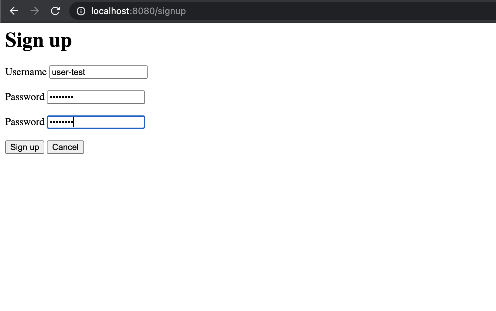
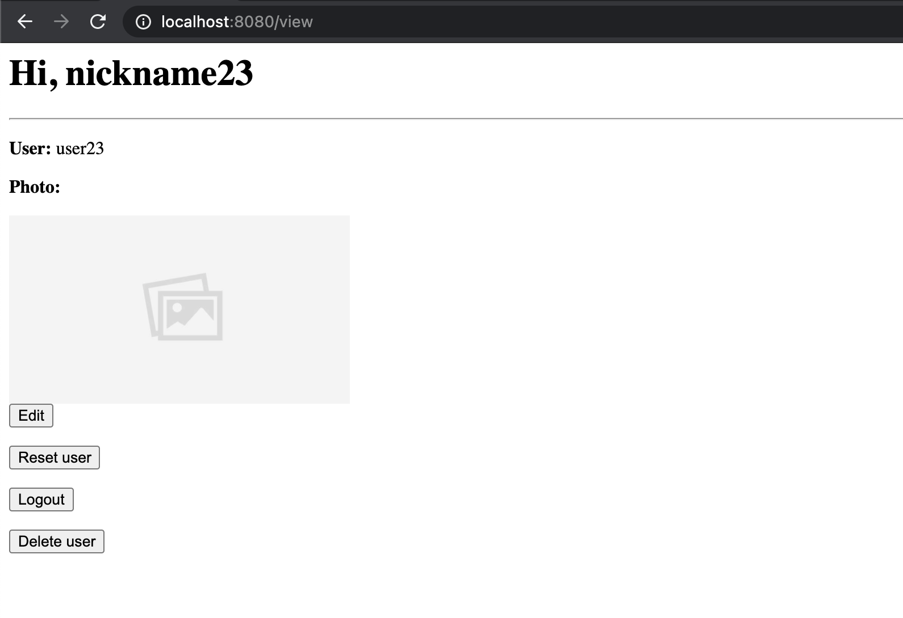
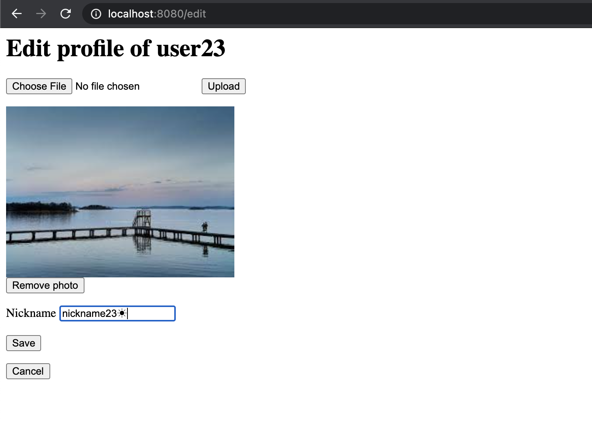
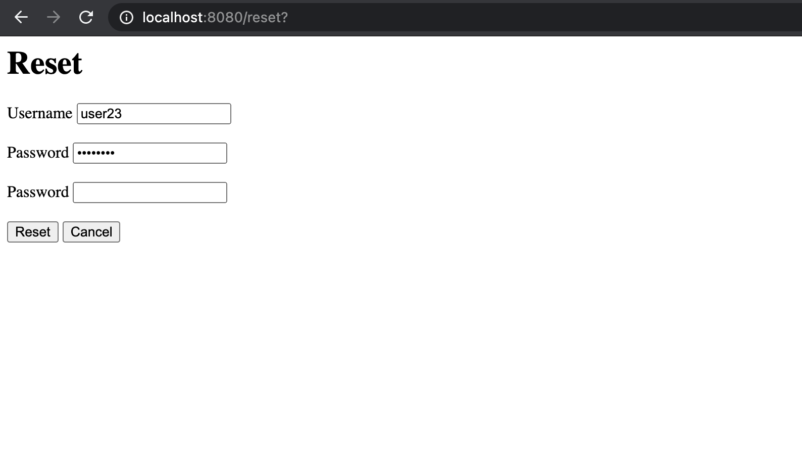

# Performance

## Table of Content
### [Product and Implementation](#product-and-implementation)
#### [Introduction](#introduction)
#### [Index Page](#index-page)
#### [Signup Page](#signup-page)
#### [View Page](#view-page)
#### [Reset Page](#reset-page)

---------

## Product and Implementation

### Introduction

The product of the project is a web app which runs on localhost:8080. It uses cookie to handle sessions, which is 
encoded, so this product is aimed for actual users to implement in browsers like Chrome. Plain HTTP requests can only 
be executed as expected with users logged in when they are executed in specific orders (for example, before try to 
edit or reset, the user should log in first), and the client must track the cookies.

There are five main pages of the app, shown as follows.

### Index Page

This is the homepage of the app, with a username text field and password text field. 

When the login button is clicked, the behavior is:
* If the username exists:
    * If the password is correct: redirect to view page with this user's information.
    * If the password is incorrect: stays on the same page with an error message telling that the password is incorrect
      besides the password text input field.
* If the username does not exist:
    * Redirect to the signup page with this username.

When the signup button is clicked, it directly redirects to the signup page.

### Signup Page

The signup page has an additional password box for the user to confirm the password compared to login page.

When the signup button is clicked, the behavior is:
* If the username is valid, i.e. has 4-20 (inclusive) characters with only alphanumerical characters and/or hyphen ('-')
  and underscore ('_'), starting with an alphabetical character:
  * If the username already exists in the database: one will stay on the page, and an error message will appear besides
    the username input box.
  * If the username is not registered yet:
    * If the password is 4-20 (inclusive) characters:
      * If the second password is the same as the first one: the user is added to the database, i.e. successfully 
      signed up, and redirected to the edit information for the user to provide profile.
      * If the second password is not the same as the first one: one will stay on the page, and an error message will 
      appear besides the second password input box.
    * If the password is not 4-20 (inclusive) characters: one will stay on the page, and an error message will show 
    besides the first password input box.
* If the username is invalid: one will stay on the page, and an error message will appear besides the username input box.

When the cancel button is clicked, it directly redirects to the index page.

### View Page

After successful login (or profile updating after sign up), one can see the view page with this user's information, 
including username, nickname, and photo.

The nickname is the string after "Hi," at the title. The username is indicated in the "User:" field. The photo is 
displayed under the "Photo:" field. The photo is originally encrypted and stored in a file base. When a user logs in,
the photo is decrypted and copied locally to be accessed and displayed.

If the user does not have a nickname, the string after "Hi," is "user " followed by the username. If the user does not 
have a photo, a placeholder photo is used, which is shown in the screenshot.

When edit or reset button is clicked, it redirects to edit and reset page respectively. When logout button is clicked, 
the user logs out, and the local temporary decrypted photo is removed. When delete button is clicked, the user is 
deleted permanently from the database, and both its local temporary decrypted file and its encrypted photo in the file 
base are removed.

### Edit Page

After successful login (or sign up), a user can choose to edit profile, including profile photo and nickname.

One can click on the button to choose file, which opens a file browser and allows the user to upload a file. Then, upon 
clicking the upload button besides, the local temporary photo is updated as a copy of the new photo, and the photo shown 
below is updated. Of course, one can also choose to remove this photo. One can also update the nickname. It supports 
UTF-8 encoding.

When save button is clicked, all information in this page is stored and used to replace the original data of the user in 
the database. If the photo is removed before saving, the profile photo in the file base is also removed when changes are 
saved.

When cancel button is clicked, all changes made are aborted. The user profile photo is regenerated from data in the 
database and file in the file base.

Both bottons redirect to the view page after clicking.

### Reset Page

After successful login (or sign up), a user can choose to reset basic information, including username and password. The
reset page shares the same template with signup, and their behaviors are similar.

A note to mention is that when password is updated, the photo in the file base is updated accordingly so that it is 
encrypted using the new password.

## Test cases